# Chapter 1 : What is Burp Extender ?

## tl;dr
This post talks about:
1. [What is Burp Extender?](#Burp-Extender)
2. [What are Burp API Extender interfaces?](#Burp-Extender-Interfaces)
3. [Setup Dev Environemnt using IntelliJ](#setup-dev-environment-using-IntelliJ) 

## Burp Extender
Burp Extender provides necessary functionality extension required for creation of Burp Suite extensions. 
The Extender tab exposes all APIs required for development of custom extensions in the form of [Java Interfaces](http://tutorials.jenkov.com/java/interfaces.html). These interfaces provides bindings for non Java environment as well, for Python through [Jython](https://www.jython.org/) and for Ruby through [JRuby](https://www.jruby.org/).

From now I will be only talking about Java Interfaces.

You can see the list of Interfaces under `Burp` -> `Extender` -> `APIs`.
<p align=center>
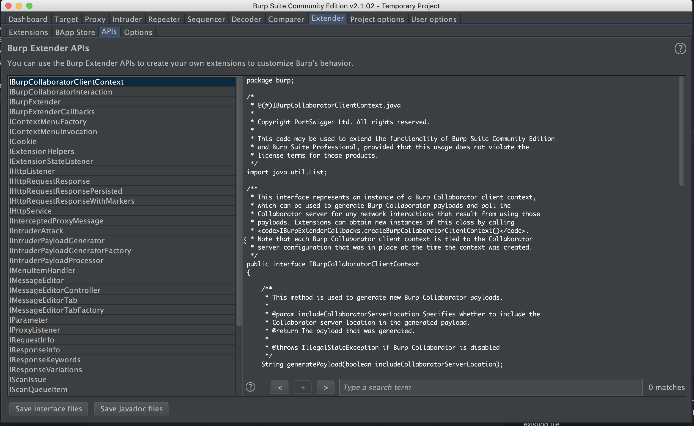
</p>

In the image above if you see, on the left hand side you see the list of all the interfaces available for you to implement a custom functionality and if you select any of those interfaces, you will see the in detail explanation of what that interface does and how/what can be achieved after implementing those interface.

`IBurpExtender.java` that the entry point of any Extender plugin you write. And the class implementing this interface should implement `void registerExtenderCallbacks(IBurpExtenderCallbacks callbacks)` abstract function. This is what Java Doc of `IBurpExtender` talks about itself.

```java
package burp;

/*
 * @(#)IBurpExtender.java
 *
 * Copyright PortSwigger Ltd. All rights reserved.
 *
 * This code may be used to extend the functionality of Burp Suite Community Edition
 * and Burp Suite Professional, provided that this usage does not violate the
 * license terms for those products.
 */
/**
 * All extensions must implement this interface.
 *
 * Implementations must be called BurpExtender, in the package burp, must be
 * declared public, and must provide a default (public, no-argument)
 * constructor.
 */
public interface IBurpExtender
{
    /**
     * This method is invoked when the extension is loaded. It registers an
     * instance of the
     * <code>IBurpExtenderCallbacks</code> interface, providing methods that may
     * be invoked by the extension to perform various actions.
     *
     * @param callbacks An
     * <code>IBurpExtenderCallbacks</code> object.
     */
    void registerExtenderCallbacks(IBurpExtenderCallbacks callbacks);
}
```

We will talk about it in good detail later in this series.

## Burp Extender Interfaces

All Burp Extender API interfaces are prefixed with `I` e.g `IIntruderPayloadProcessor`. The suffix after `I` is for the use case of API Interface, like:

- `IBurpExtender`: All extensions must implement this interface.
- `IIntruderPayloadProcessor` - This interface is used for custom Intruder payload generators.
- `IParameter` - This interface is used to hold details about an HTTP request parameter.

The full list of Interfaces can be [checked here](https://portswigger.net/burp/extender/api/index.html)


## Setup DEV environment using IntelliJ
1. Create new Java Project in IntelliJ. Following the steps in the Image one after the other.
    <p align="center">
    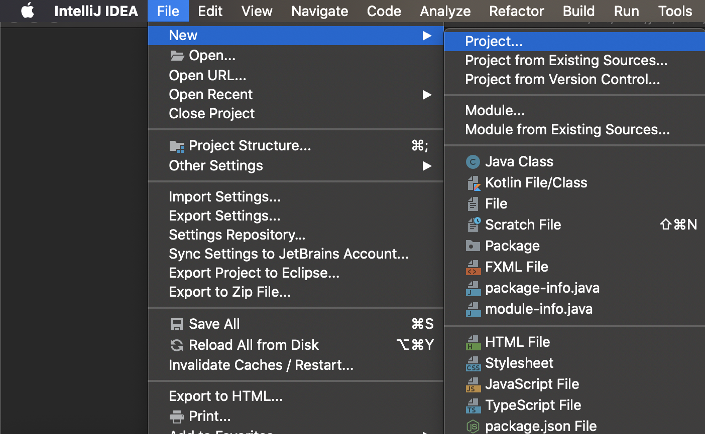
    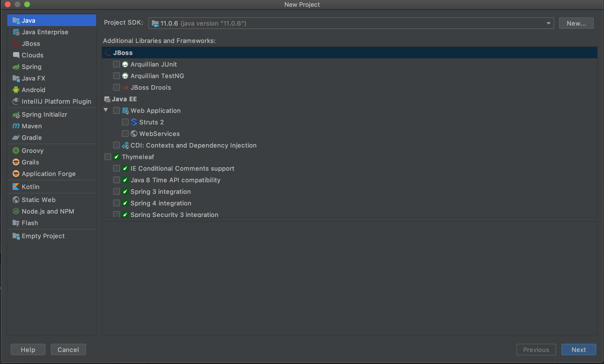
    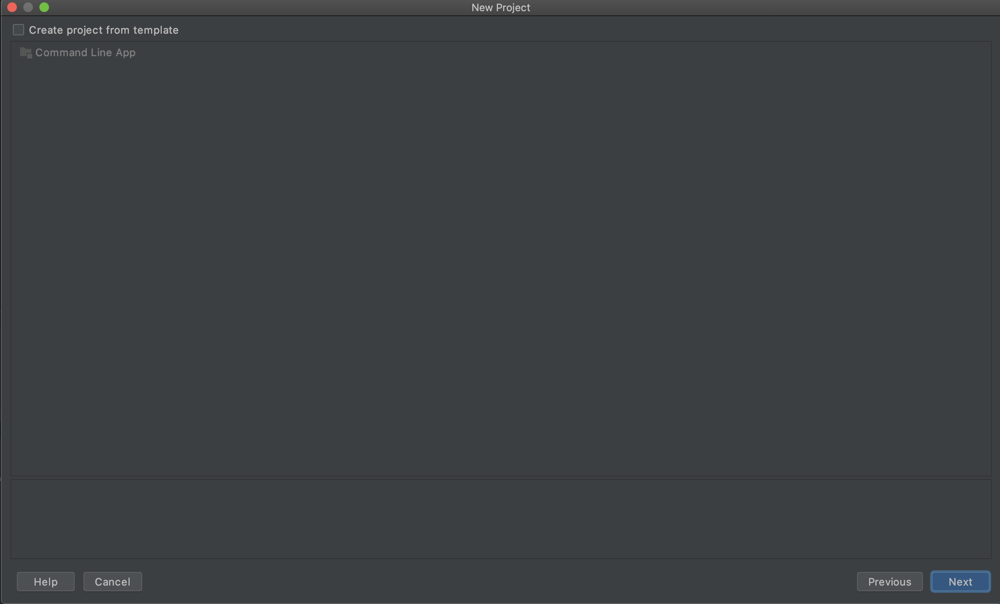
    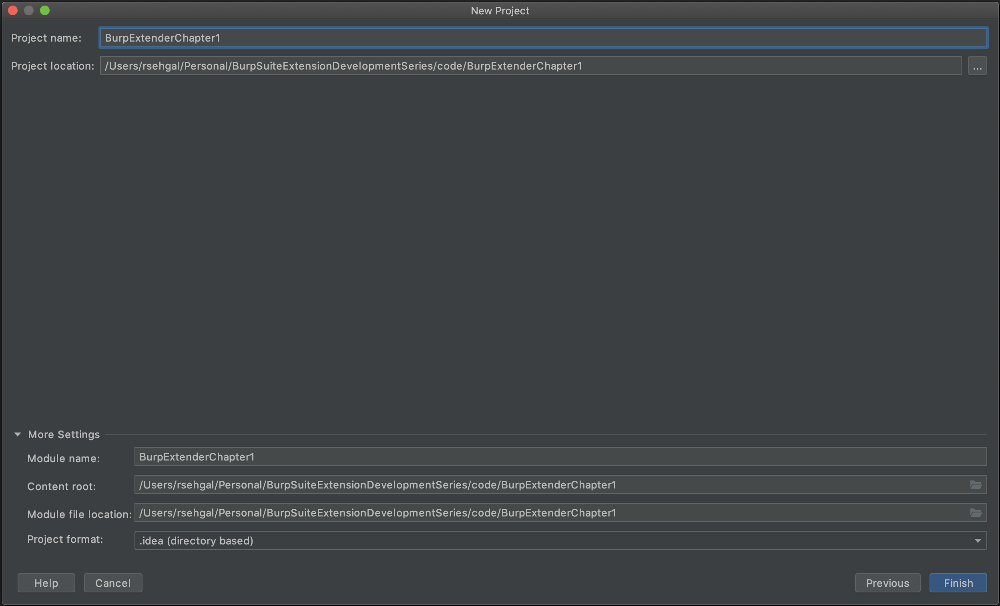
    </p>
3. Create a package for you Java application, this is required for bundle(jar) creation. Once the package is created create a file under package with name `BurpExtender.java`. Follow the steps in Image for more clarity.
    <p align="center">
    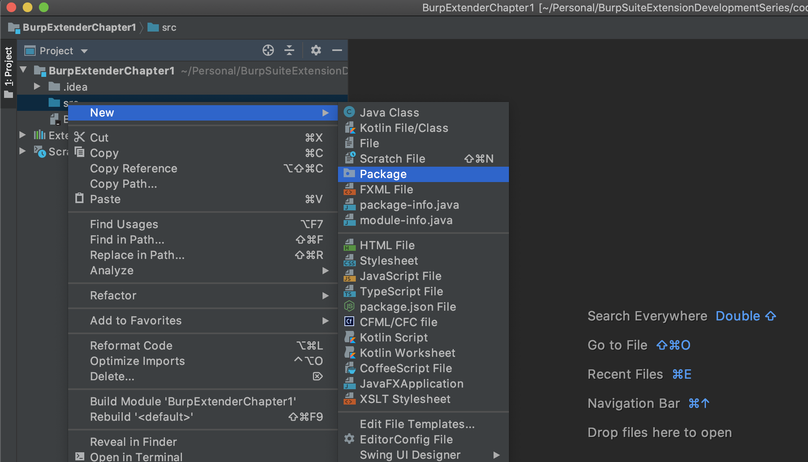
    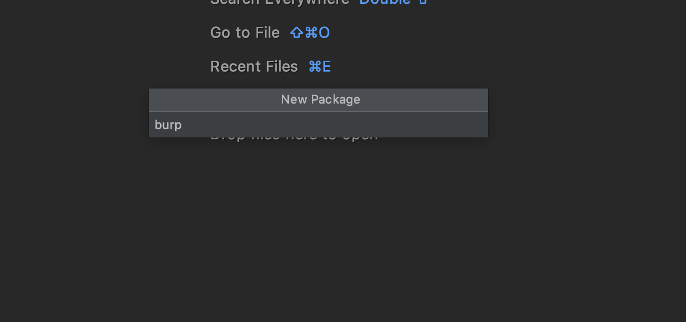
    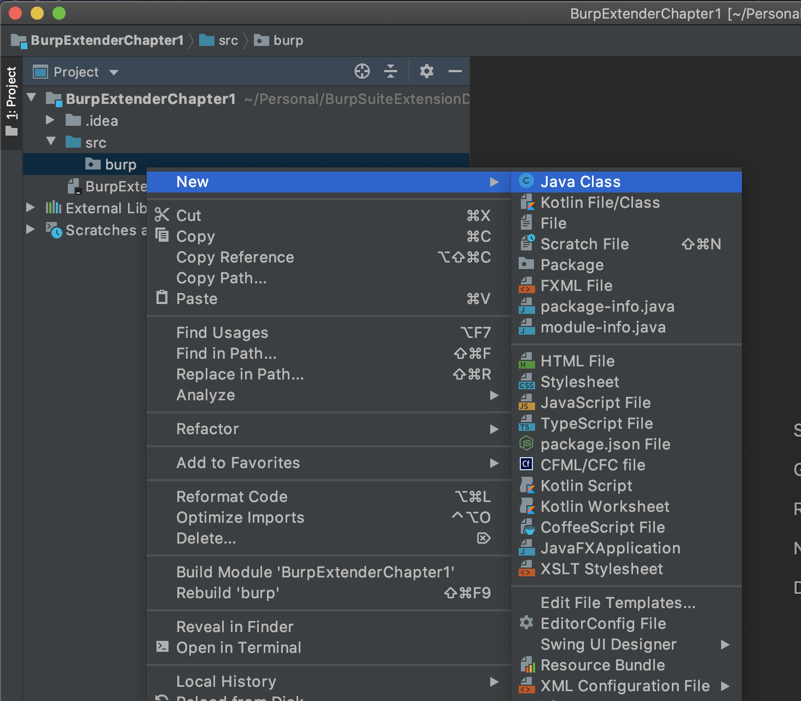
    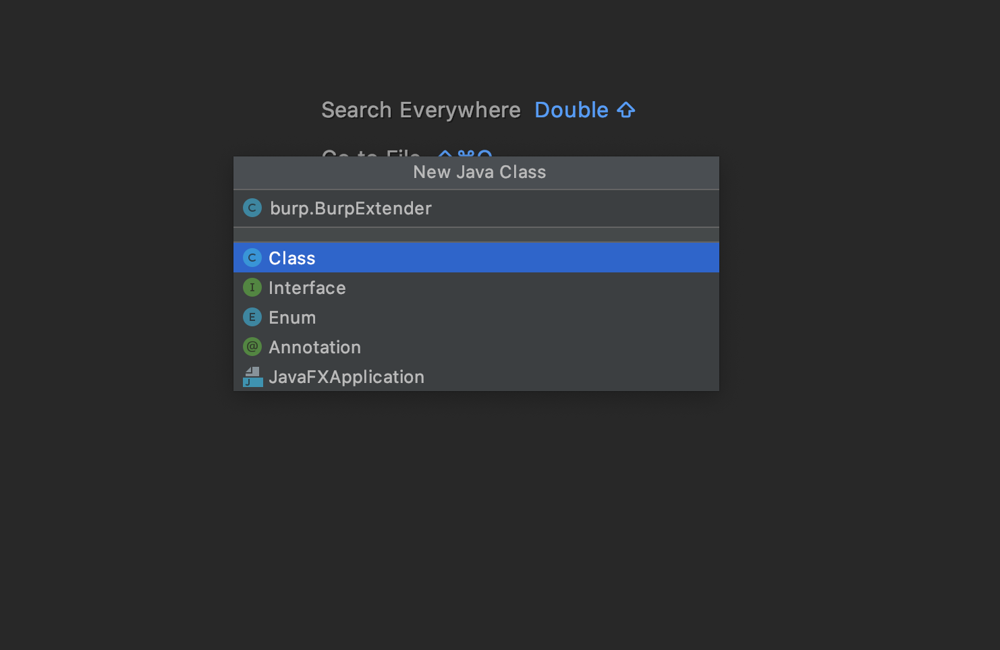
    </p>
2. Setup `Artifact build` with IntelliJ. This step is necessary to create jar for your Burp Extender that you will load in your application. Once you have completed the above  step, you will have directory structure of something like this.
    <p align="center">
    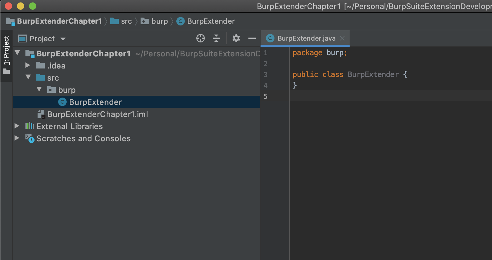
    </p>

    Now the next step is to setup artifact build which on our case will be Jar.
    Quikcly navigate through, `File` -> `Project Structure` -> `Project Settings` -> `Artifacts`, then click on `+` which is `Add`.
    
    <p align="center">
    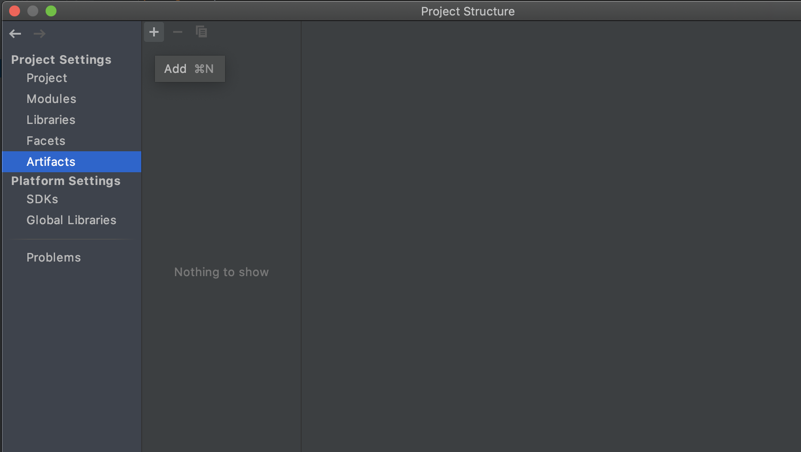
    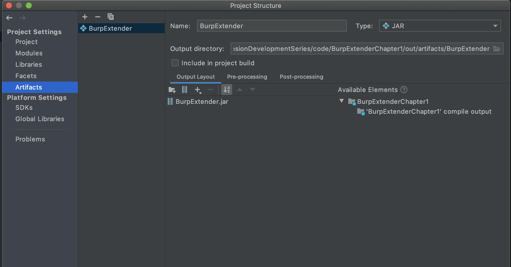
    </p>
    Click `Apply` or `Ok`.
3. At this step you are ready to go to [next chapter](series/Chapter2/README.md).

<p align=center>
<h3>
<a href="series/Chapter2/README.md"> Next: Creating Hello World Extender plugin</a>
</h3>
</p>