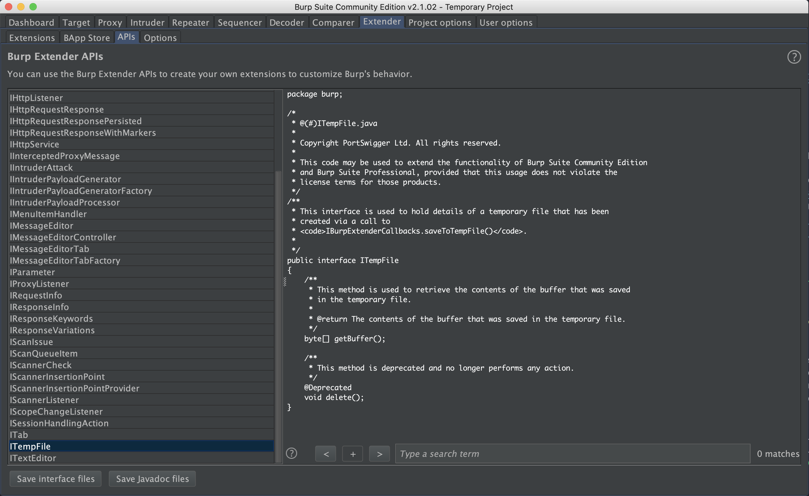
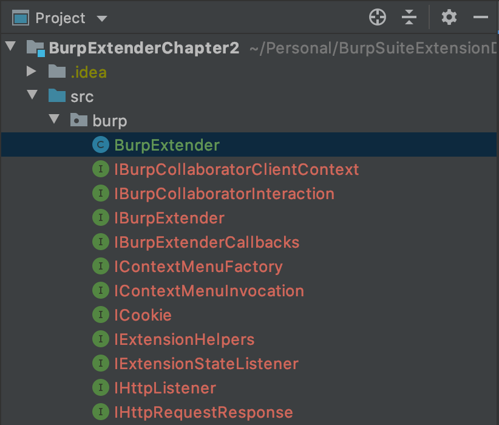
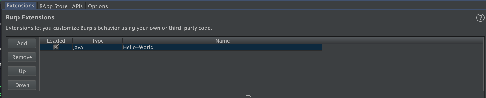
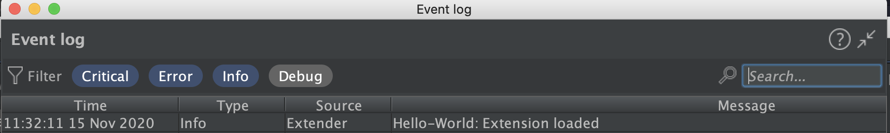

# Hello-World: Burp Suite Extender
In this chapter we will build a simple `hello-world` kind of plugin for Burp suite. This plugin will just load in the Burp Runtime and will run in background.


## tl;dr
This post talks about:
1. [Setting up Extender Development Environment](#setting-up-extender-development-environment)
2. [Hello Burp](#hello-burp)
3. [Understanding Hello Burp](#understanding-hello-burp)

## Setting up extender development environment
This step is the continuation of the step discussed in [Chapter 1](../../series/Chapter1). In this continuation phase we will discuss about how to load Extender interfaces from Burp to our dev environment. This step is pretty Straight forward.

<p align=center>

</p>

Click on `Save Interface Files` and **save it in directory where you have stored the `BurpExtender.java` file**. Make sure it belongs to `burp` package, which is the same for `BurpExtender.java`.

Once you do this, your Extender directory would look something like this.

<p align=center>

</p>


## Hello Burp
Put the following code in `BurpExtender.java` file `save` it and `build artifact`.

```java
package burp;

public class BurpExtender implements IBurpExtender{
    @Override public void registerExtenderCallbacks(IBurpExtenderCallbacks callbacks) {
        callbacks.setExtensionName("Hello-World");
        callbacks.setAlert("Extension Loaded")
    }
}
```

Once the artifact is built, you need to load it into the BurpSuite Environment. Click on `Add`, and select the location of `Jar` file.

<p align=center>

</p>

You can see the result of loaded extension in dashboard. `WOW` :smile: we built and loaded an extension into `Burp`. Kudos to you, to achieve this landmark.

<p align=center>

</p>

## Understanding Hello Burp
`Hello World` for burp looks something like this below snap, and now lets try to understand the tech terms(`jargons`).

```java
public class BurpExtender implements IBurpExtender{
    @Override public void registerExtenderCallbacks(IBurpExtenderCallbacks callbacks) {
        callbacks.setExtensionName("Hello-World");
        callbacks.setAlert("Extension Loaded")
    }
}
```

1. As discussed in [Chapter 1](../../series/chapter1), every burp extender plugin needs to implement, `IBurpExtender`. So this line `public class BurpExtender implements IBurpExtender` does the same thing.

2. `IBurpExtender` has a `registerExtenderCallbacks` which takes input from Burp UI and receive a `callback` as and when this plugin is called. `callbacks` will expose multiple methods which can be used to interact Burp Suite such as :
    - `setExtensionName()`: Set our extension name
    - `makeHttpRequest()`: Send an HTTP request and retrieve its response.
    - `issueAlert()`: Send a message to Burp’s Alert Tab.
    - `getBurpVersion()`: Figure-out the version of Burp Suite.
    - `isInScope()`: Check if a URL is in Burp Project’s scope or not.  
More in [detail](https://portswigger.net/burp/extender/api/burp/iburpextendercallbacks.html)

3.  The above code calls `setExtensionName()` method to set the name of the extension that will be visible in Burp Suite UI; there-after `issueAlert()` is used to send an alert to the Alert tab of Burp Suite with a message. Please note that the parameters and return types of the functions have to referred from their API reference. The Extender [API reference](https://portswigger.net/burp/extender/api/burp/IBurpExtenderCallbacks.html#setExtensionName(java.lang.String)) is the to-go place to discover golden extensibility gems offered by Burp Suite.

Extension says `Hello World!`

### [Next Chapter : Extender Plugins Deep Dive](series/Chapter3/README.md)