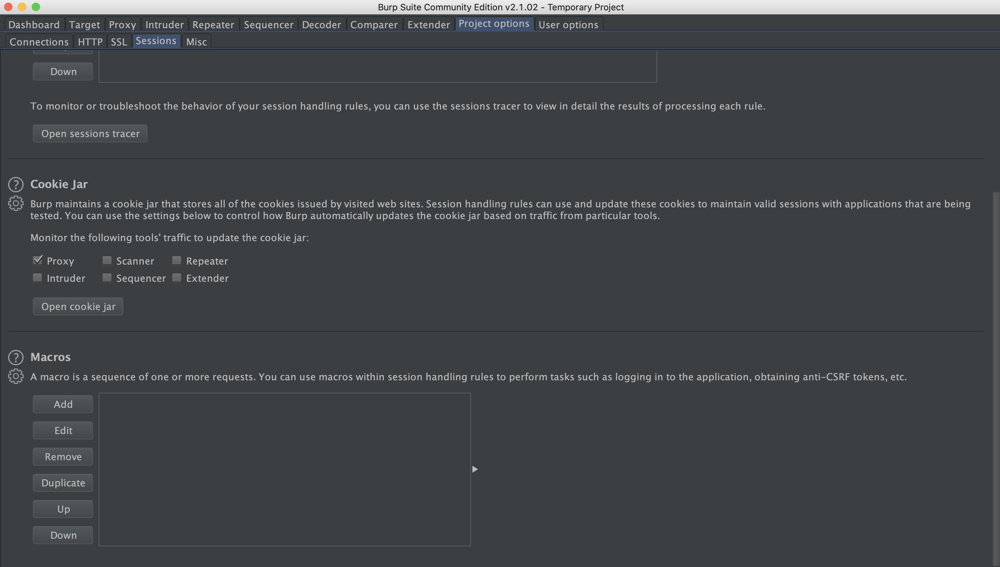
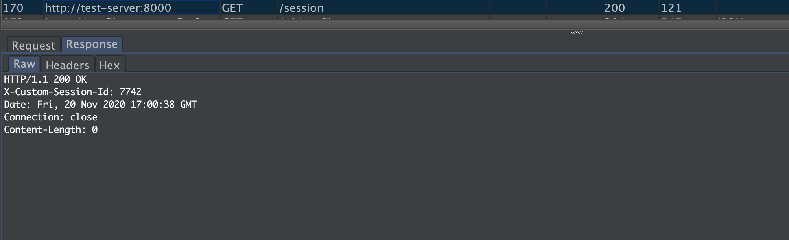
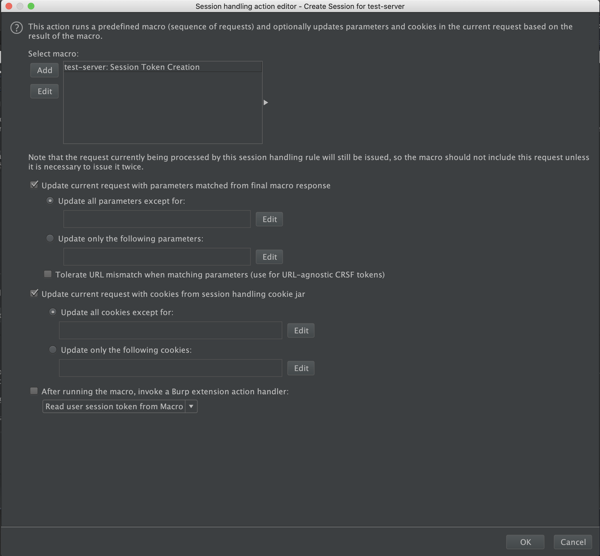

# Burp Suite Extension : Custom Session Tokens

At times you might want to scan application with custom session token set right ? If yes this extender plugin cum tutorial can save you here :smile:

This chapter talks about how Burp suite extender APIs can be used to create plugins which can modify the session related information on the fly. This chapter is more of a exercise than a plugin use case.

This chapter comes with demo server to test the developed plugin. The application server code is here [Server](../../code/BurExtenderChapter5/server.js). Just run this server as `node server.js`, this will spin up the server at port `8000`.
 
If you carefully observe the `server.js` file, you can notice that session information is stored in `SESSION_ID_KEY` variable which points to `X-Custom-Session-Id`.

```js
const http = require('http');

const PORT = 8000;

const SESSION_ID_KEY = 'X-Custom-Session-Id'
```

So in this chapter or this exercise our task would be to record this session variable in one of the burps macro and then transfer it along with all the subsequent requests.

### Step 1: Create a macro
A word about Burp Macro.

> A macro in Burp Suite is a series of HTTP requests to be sent to the server prior to requests which have been proxied by Burp. Once the macro requests have been carried out, the set of parameters taken from the response of the final macro request can then be passed on to the request that called the macro.

To create : `Burp` ->  `Project options` -> `Sessions` -> `Macros` -> `Add`

<p align=center>

</p>

The custom server code shipped with this chapter has `/sessions` endpoint that provides custom session token `curl localhost:8000/session`, the new session request can be made through `curl -XPOST localhost:8000/session`.

<p align=center>

</p>

So to record macro for session token generation proxy `POST` request throuh `Burp` and record macro.

1. Proxy post request :
    - Send post request from curl: `curl -XPOST http://test-server:8000/session -x http://localhost:8080`
    This will send the post request over burp proxy.
2. Goto : `Burp` ->  `Project options` -> `Sessions` -> `Macros` -> `Add`, just pick the post request from the history tab. I have named the macro : `test-server: Session Token Creation ` , remember this, as we will need it. :smile:

### Step 2 : Create Extender Plugin to consume Macro
To consume a macro for session handling mechanism we need to implement : `ISessionHandlingAction`. So flow is simple again, create a class implementing this Interface then register this call for events.

```java
package burp;

import java.util.List;

public class BurpExtender implements IBurpExtender, ISessionHandlingAction {
    IBurpExtenderCallbacks callbacks;
    IExtensionHelpers helpers;

    private static String SESSION_ID_KEY = "X-Custom-Session-Id";
    private static final byte[] SESSION_ID_KEY_BYTES = SESSION_ID_KEY.getBytes();
    private static final byte[] NEWLINE_BYTES = new byte[] { '\r', '\n' };

    @Override public void registerExtenderCallbacks(IBurpExtenderCallbacks callbacks) {
        this.callbacks = callbacks;
        this.helpers = callbacks.getHelpers();

        callbacks.setExtensionName("Custom Session Token");
        callbacks.issueAlert("Plugin Loaded");
        callbacks.issueAlert(String.format("Session ID being used : %s", SESSION_ID_KEY));


        /*
        Register the SessionHandler
         */
        callbacks.registerSessionHandlingAction(this);
    }

    @Override public String getActionName() {
        return "Read user session token from Macro";
    }

    /*
    This function is executed after macro call and before a subsequent Scanner or Intruder call.
     */
    @Override public void performAction(IHttpRequestResponse currentRequest, IHttpRequestResponse[] macroItems) {
        /*
        Don't execute anything if there is no macro.
         */
        if(macroItems.length == 0) return;

        /*
        Extract Macro response
         */
        final byte[] macroResponse = macroItems[macroItems.length - 1].getResponse();

        /*
        Extract all headers from response
         */
        final List<String> headers = helpers.analyzeResponse(macroResponse).getHeaders();

        /*
        Extract the Custom Session token header from all headers
         */
        String sessionToken = null;
        for(String header : headers){
            if(!header.startsWith(SESSION_ID_KEY)) continue;

            sessionToken = header.substring(SESSION_ID_KEY.length()).trim();
        }

        /*
        If session token is not identified skip.
         */
        if(sessionToken == null) return;

        /*
        Otherwise, append the session token to currentRequest
         */
        final String req = helpers.bytesToString(currentRequest.getRequest());
        final int sessionTokenKeyStart = helpers.indexOf(helpers.stringToBytes(req),
                                                         SESSION_ID_KEY_BYTES,
                                                         false,
                                                         0,
                                                         req.length());
        final int sessionTokenKeyEnd = helpers.indexOf(helpers.stringToBytes(req),
                                                       NEWLINE_BYTES,
                                                       false,
                                                       sessionTokenKeyStart,
                                                       req.length());

        /*
        Join together First line + Session header line + rest of request
         */
        String newRequest = req.substring(0, sessionTokenKeyStart) +
                String.format("%s: %s", SESSION_ID_KEY, sessionToken) +
                req.substring(sessionTokenKeyStart + 1, sessionTokenKeyEnd);

        /*
        Update the current request headers
         */
        currentRequest.setRequest(helpers.stringToBytes(newRequest));
    }
}
```
Code above is self explanatory. Build it and load it in Burp.

### Step 3 : Link Burp Macro and Session Handling Plugin together
Goto : `Burp` -> `Project options` -> `Sessions` -> `Session Handling Rule` -> `Add Session handling rule`

<p align=center>

</p>
 
Now if you make any request through `Scanner` or `Intruder`, It will be routed through Macro and Plugin, which will inject the session header in request.