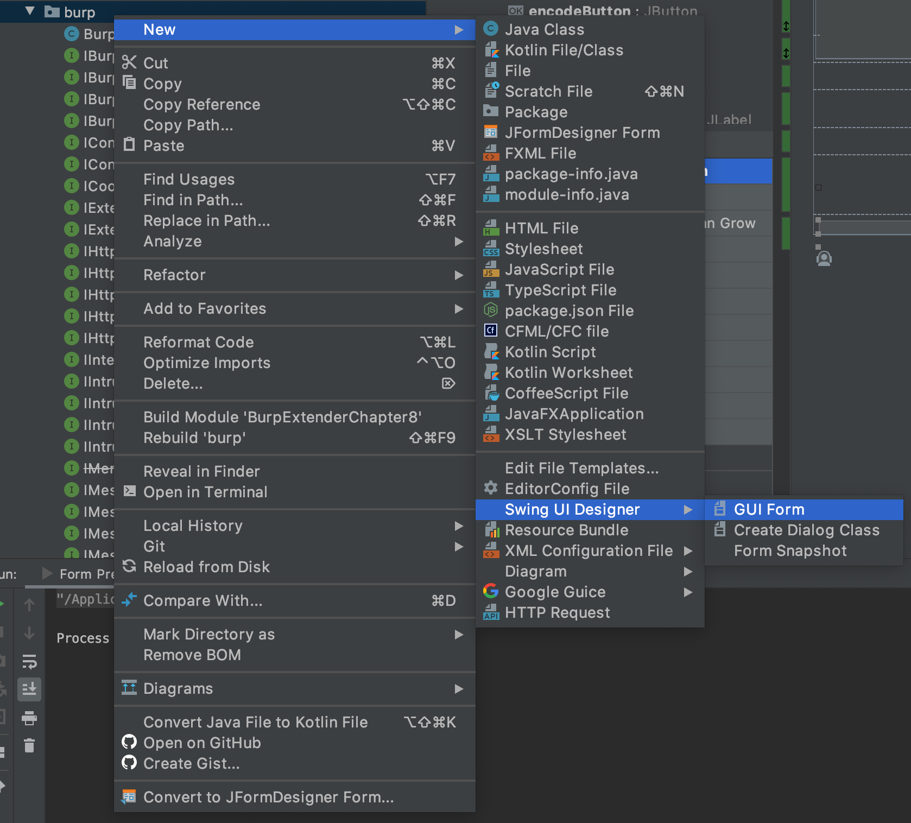
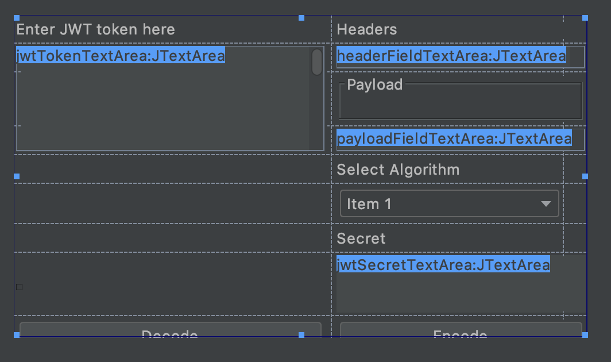

# Burp Suite Extension - Create a Separate tab plugin : JWT Encode/Decode

This chapter is going to be bit length and tricky so try to be with the flow, otherwise you have to read from start 😏 😝

This Tab need some knowledge of Java `Swing` Framework, but if you don't have any knowledge, it wont be too difficult to deal with.

## tl;dr
In this chapter we will be creating a separate tab plugin.
- This tab will show up in the Burp's Top tab menu like this.
    <p align=center>
        
    </p>
- We will design(not code) the UI of this Tab.
    - But we need to encode the UI behavior though Swing Listener.
    - At the end we will have plugin that looks for something like this.
    <p align=center>
        
    </p>
    Trust me this UI design wont be difficult at all.
- This tab plugin will be very simple version of what we have in [jwt.io](jwt.io)


## Creating a New tab in Burp
To create a new Tab which will be visible in Burp toolbar, You need to implement : definitely `IBurpExtender` but `ITab` as well. Whose declaration looks like:
```java
public interface ITab
{
    /**
     * Burp uses this method to obtain the caption that should appear on the
     * custom tab when it is displayed.
     *
     * @return The caption that should appear on the custom tab when it is
     * displayed.
     */
    String getTabCaption();

    /**
     * Burp uses this method to obtain the component that should be used as the
     * contents of the custom tab when it is displayed.
     *
     * @return The component that should be used as the contents of the custom
     * tab when it is displayed.
     */
    Component getUiComponent();
}
```

The content returned by `getUiComponent()` is what which is rendered under the plugins tab window.

To create the UI for tab I will be using, `IntelliJ` in built form designer, through this you can create UI very quickly with drag and drops and code only the event listeners.

Its available under :
    <p align=center>
        
    </p>

Once you do this, Two file will be created, one will be Form in UI and another will be its implementation at `java` class level. I have named those files as `JWTDecodeTabForm.java` & `JWTDecodeTabForm.form`. I have kept the class `JWTDecodeTab` separate which implements `ITab` interface.


## Create UI for tab
- Select the any layout of your choice for form.
- Create UI by drag and drop.
- I have created something like this, mimicking the UI from [jwt.io](jwt.io)
    <p align=center>
        
    </p>
> You may or may not need the external deps to be installed. I usually prefer deps installation through maven, but its completely your choice. With IntelliJ and maven its easy `File` -> `Project Structure` -> `Project Settings` -> `Libraries` -> `+` -> `From maven`. Download `sources` too, for intellij to provide autocomplete syntax. 
- we Will define the functionality of each of the `buttons` later.

## Complete the Burp Extender ITab plugin
- Implement `IBurpExtender` like always and register Tab.
    ```java
    /*
    BurpExtender.java
    */
    package burp;

    public class BurpExtender implements IBurpExtender {
        @Override public void registerExtenderCallbacks(IBurpExtenderCallbacks callbacks) {
            /*
                This is extension name, not the tab name. Tab name is picked up from ITab concrete class.
            */
            callbacks.setExtensionName("JWT Decode Extension");
            callbacks.addSuiteTab(new JWTDecodeTab(callbacks));
        }
    }

    ```
- Create class implementing `ITab`, which we have called in `BurpExtender` as `JWTDecodeTab`.
    ```java
    /*
    JWTDecodeTab.java
    */
    package burp;

    import java.awt.*;

    public class JWTDecodeTab implements ITab {
      IBurpExtenderCallbacks callbacks;

      public JWTDecodeTab(IBurpExtenderCallbacks callbacks) {
        this.callbacks = callbacks;
      }

      @Override public String getTabCaption() {
        return "JWT Decode/Encode";
      }

      @Override public Component getUiComponent() {
        return new JWTDecodeTabForm(callbacks).getFrame();
      }
    }
    ```
- `JWTDecodeTabForm` is the class, which we designed Swing UI for through `IntelliJ designer`. On Bare minimum this class looks like.
    ```java
    public class JWTDecodeTabForm {
    private JPanel basePanel;
    private JTextArea jwtTokenTextArea;
    private JTextArea headerFieldTextArea;
    private JButton decodeButton;
    private JButton encodeButton;
    private JTextArea payloadFieldTextArea;
    private JTextArea jwtSecretTextArea;
    private JComboBox comboBox1;
    private JLabel jwtValidationErrorLabel;

    IBurpExtenderCallbacks callbacks;

    public JWTDecodeTabForm(IBurpExtenderCallbacks callbacks) {
        this.callbacks = callbacks;
    }

    public Component getFrame(){
        return this.basePanel;
    }
    ```
    - `basePanel` is the container component which contains all the other components, so I have returned this only which will display the UI for the tab.

Once you do all these steps and build artifact, upon loading that into `Burp` will result in something like this:
    <p align=center>
        
    </p>
This UI though is not functional as no click events are registered at all for `Decode` & `Encode` buttons.